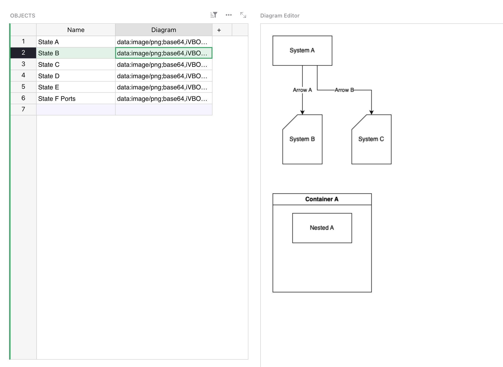
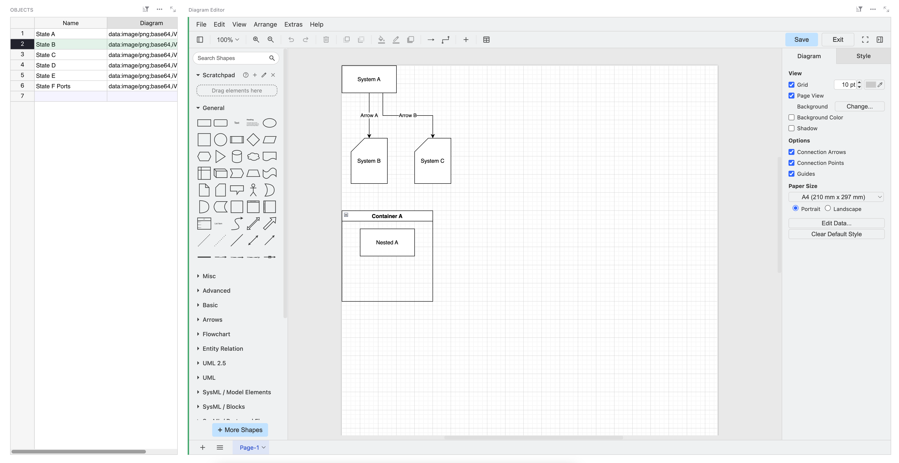

# grist-widget-drawio
Custom widget for Grist to embed and edit draw.io diagrams.

## How-To

1. To use this, ensure you have a column called `Diagram` in the table you wish to link to this widget. 
2. Add a new custom widget, and use this URL: `https://lgdan.github.io/grist-widget-drawio/`

## Warnings

The code behind this is not robust. Whilst it does read and save back to the selected cell, it does not handle the following situations:

- 🔒 Someone else edits the cell you're editing (no locking).
- 🗑️ You click on a different cell (no autosave, no warning) and your work is lost.

**⚠️ Size Growth**: This widget also saves data in base-64 encoded PNGs. This means image data is being stored in your grist document. Changes will add up drastically in the document history and may result in very large documents after long edit sessions or general build-up of history data over time.

## Interesting Stuff

Because the drawing XML is embedded in the PNG metadata, you can extract it. I've included a sample (see extract_xml.py) to use. You can then have all sorts of fun my reading the shapes and lines (vertecies and edges) from the diagram data.

This leads to all sorts of fun, like linking rows to entities in the diagram, or having other rows do lookups to see if they are 'mentioned' in the diagrams.

If you create a new column called `XML` and put the contents of `extract_xml.py` in there, you can then:

### Example 1, list the vertecies:

```python
[element.get("value",default=element.get("id")) for element in $XML.findall("diagram/mxGraphModel/root/mxCell") if element.get("vertex",default=None)]
```

### Example 2, list the edges:

```python
[element.get("value",default=element.get("id")) for element in $XML.findall("diagram/mxGraphModel/root/mxCell") if element.get("edge",default=None)]
```

### Example 3, list the relationships between things:

```python
vertecies = [element for element in $XML.findall("diagram/mxGraphModel/root/mxCell") if element.get("vertex",default=None)]
edges = [element for element in $XML.findall("diagram/mxGraphModel/root/mxCell") if element.get("edge",default=None)]

relationships = []

for edge in edges:
  
  edgeText = edge.get("value",default=edge.get("id"))
  
  sourceVertexId = edge.get("source",default="?")
  targetVertexId = edge.get("target",default="?")
  
  if ("?" not in [sourceVertexId, targetVertexId]):
    sourceVertex = [x for x in vertecies if x.get("id") == sourceVertexId]
    targetVertex = [x for x in vertecies if x.get("id") == targetVertexId]
    sourceVertexValue = sourceVertex[0].get("value")
    targetVertexValue = targetVertex[0].get("value")
    relationships.append(f"[{sourceVertexValue}] --[{edgeText}]--> [{targetVertexValue}]")
    # return (sourceVertex + " --> " + targetVertex)
    
return "\n".join(sorted(relationships))
```

### Example 4, perform validation:

```python
vertecies = [element for element in $XML.findall("diagram/mxGraphModel/root/mxCell") if element.get("vertex",default=None)]
edges = [element for element in $XML.findall("diagram/mxGraphModel/root/mxCell") if element.get("edge",default=None)]

issues = []

# Labels
[issues.append("[WARN] Edge '" + edge.get("id") + "' should have a value.") for edge in edges if not edge.get("value")]
[issues.append("[WARN] Vertex '" + vertex.get("id") + "' should have a value.") for vertex in vertecies if not vertex.get("value")]

# Edges should be connected
[issues.append("[WARN] Edge '" + edge.get("value",default=edge.get("id")) + "' should be connected at both ends.") for edge in edges if not (edge.get("source") and edge.get("target"))]


if (issues):
  return "\n".join(issues)
else:
  return "Passed."
```

### Example 5, compare two diagrams:

(This assumes you have a `Relationships` column in your diagram table following example 3.)

```python
as_is_state = $As_Is.Relationships.split("\n")
to_be_state = $To_Be.Relationships.split("\n")

diff = sorted(set(as_is_state) ^ set(to_be_state))

return "\n".join(diff)
```

## Screenshots





## Copyright and Acknowledgements

- This code is released under MIT license. I am not affiliated with Grist, Grist Labs, Draw.IO, or JGraph Ltd in any way.

- Grist is (c) Grist Labs 2025 (https://www.getgrist.com)

- Draw.io and Diagrams.net is (c) 2005-2023 JGraph Ltd, Artisans' House, 7 Queensbridge, NN4 7BF, Northampton, England. Company #04051179. (https://www.drawio.com)